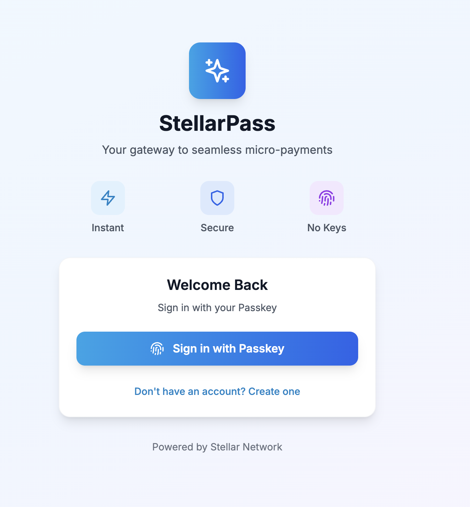
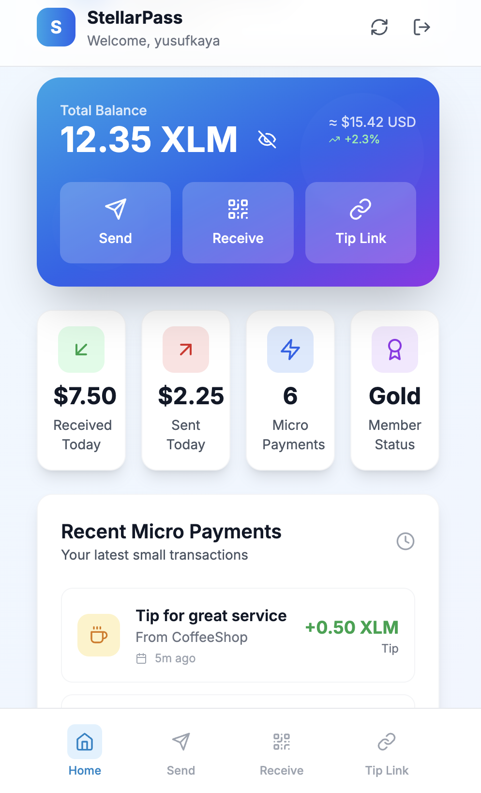

# StellarPass

tellarPass, your gateway to micro-payments on the Stellar network. Experience Web2-level UX with Web3 infrastructure.



*StellarPass Dashboard - Your gateway to seamless micro-payments*

## 🌟 Features Overview

- 🔐 **Passkey Authentication** - No seed phrases, no passwords, just Face ID/Touch ID
- 💰 **Real-time Balance** - View your XLM balance with live updates
- ⚡ **Instant Payments** - Send XLM to any Stellar address in seconds
- 📱 **QR Code Generation** - Easy receiving with scannable QR codes
- 🎁 **Tip Links** - Create personalized tip links for social media
- 🎨 **Modern UI** - Beautiful, mobile-first design with smooth animations
- 🚀 **Consumer-Ready** - Web2-level user experience on Web3 infrastructure
- 📊 **Rich Analytics** - Track micro-payments with detailed categorization
- 🏆 **Gamification** - Member status and achievement system

## 🛠 Tech Stack

- **React 18** with TypeScript
- **Vite** for blazing fast development
- **Tailwind CSS** for styling
- **Framer Motion** for animations
- **Stellar SDK** for blockchain integration
- **Lucide React** for icons
- **React Hot Toast** for notifications
- **QR Code React** for QR generation
- **React Router DOM** for navigation

## 🚀 Getting Started

### Prerequisites

- Node.js 16+ 
- npm or yarn

### Installation

1. Clone the repository:
```bash
git clone <repository-url>
cd stellarpass-react
```

2. Install dependencies:
```bash
npm install
```

3. Start the development server:
```bash
npm run dev
```

4. Open your browser and navigate to `http://localhost:3000`

## 📸 App Screenshots

### Dashboard Overview


*Complete wallet interface showing balance, transactions, and quick actions*

## 📱 Application Pages & Features

### 🔐 Authentication Page (`/login`)

**Features:**
- **Dual Mode Interface**: Switch between login and signup
- **Mock Passkey Integration**: Simulated biometric authentication
- **Username Validation**: Prevents duplicate usernames
- **Smooth Animations**: Welcome animations and transitions
- **Responsive Design**: Works on all device sizes

**User Flow:**
1. Choose username for new account
2. Click "Create Account" 
3. Mock passkey setup with loading animation
4. Automatic redirect to dashboard upon success
5. Persistent login state in localStorage

### 🏠 Dashboard (`/`)

**Features:**
- **Profile Header**: Personalized welcome with user avatar
- **Enhanced Balance Card**: 
  - Large balance display with hide/show toggle
  - USD conversion with trend indicators
  - Beautiful gradient background with pattern overlay
- **Quick Actions**: One-tap access to Send, Receive, Tip Link
- **Statistics Grid**: 
  - Daily sent/received amounts
  - Total micro-payments count
  - Member status (Gold/Silver/Bronze)
- **Rich Micro Payments List**:
  - Categorized transactions (tip, entertainment, gaming, support, gift, content)
  - Custom icons for each transaction type
  - Real-time timestamps ("5m ago", "1h ago")
  - Color-coded categories
  - Detailed descriptions

**Mock Data Includes:**
- Coffee shop tips ($0.50)
- Music streaming payments ($1.25)
- Gaming achievement rewards ($2.00)
- Content creator support ($0.75)
- Birthday gifts ($5.00)
- News article micro-payments ($0.25)


*Rich dashboard with categorized micro-payments and beautiful UI*

### 💸 Send Page (`/send`)

**Features:**
- **Multi-Step Flow**: Form → Confirm → Authentication
- **Balance Display**: Shows available balance prominently
- **Recipient Input**: 
  - Stellar address or username support
  - Input validation and formatting
- **Amount Selection**:
  - Manual input with decimal support
  - Quick amount buttons (1, 5, 10, 25 XLM)
  - MAX button for full balance
  - Real-time USD conversion
  - Network fee display
- **Payment Confirmation**:
  - Detailed transaction review
  - Total calculation with fees
  - Back/forward navigation
- **Biometric Authentication**:
  - Mock passkey authentication overlay
  - Loading states and animations
  - Success/failure handling

**User Experience:**
- Form validation prevents invalid submissions
- Smooth page transitions
- Real-time feedback
- Error handling with toast notifications

### 📥 Receive Page (`/receive`)

**Features:**
- **QR Code Generation**:
  - Dynamic QR codes with Stellar URI format
  - Support for amount and memo parameters
  - High-quality SVG rendering
- **Request Customization**:
  - Optional amount specification
  - Memo field (28 character limit)
  - Real-time QR code updates
- **Address Management**:
  - Copy to clipboard functionality
  - Share via native share API
  - Formatted address display
- **Sharing Options**:
  - Native mobile sharing
  - Quick share buttons (Text, Email, Social, Print)
  - Copy payment links
- **Instructions**:
  - Step-by-step receiving guide
  - Best practices for sharing
  - Security tips

**Technical Details:**
- Stellar URI format: `stellar:PUBLIC_KEY?amount=X&memo=Y`
- QR code error correction level M
- Responsive QR code sizing
- Clipboard API integration

### 🎁 Tip Link Page (`/tip-link`)

**Two Modes:**

#### 1. **Personal Tip Link Management** (`/tip-link`)
- **QR Code Display**: Shareable QR for tip link
- **Link Management**: Copy and share functionality
- **Live Preview**: See how your tip page looks
- **Usage Instructions**: How to integrate with social media
- **Analytics Ready**: Track tip performance

#### 2. **Public Tip Page** (`/tip/:username`)
- **Profile Display**: User avatar and username
- **Quick Tip Options**:
  - Coffee tip (1 XLM) ☕
  - Thanks tip (5 XLM) ❤️ 
  - Awesome tip (10 XLM) ⚡
- **Custom Amount**: Manual tip amount input
- **Personal Message**: Optional message with tips (140 chars)
- **One-Click Tipping**: Instant payment processing
- **Branded Experience**: StellarPass powered footer

**Use Cases:**
- Content creators on social media
- Streamers and YouTubers
- Blog and newsletter writers
- Service providers
- Street performers and artists

## 🎨 Design System

### Color Palette
- **Primary**: Stellar blue (#4F46E5)
- **Secondary**: Purple gradients
- **Success**: Green (#10B981)
- **Warning**: Amber (#F59E0B)
- **Error**: Red (#EF4444)

### Typography
- **Headers**: Bold, large sizing
- **Body**: Clean, readable fonts
- **Monospace**: For addresses and codes

### Components
- **Cards**: Rounded corners, subtle shadows
- **Buttons**: Hover effects, press animations
- **Inputs**: Clean borders, focus states
- **Icons**: Lucide React icon set

### Animations
- **Page Transitions**: Smooth fade/slide effects
- **Button Interactions**: Scale and color changes
- **Loading States**: Spinners and pulse effects
- **Staggered Lists**: Sequential item animations

## 🔧 Architecture

### File Structure
```
src/
├── components/          # Reusable UI components
│   ├── Layout.tsx      # Main app layout wrapper
│   ├── LoadingSpinner.tsx
│   └── ProtectedRoute.tsx
├── contexts/           # React contexts for state
│   ├── AuthContext.tsx    # Authentication state
│   └── WalletContext.tsx  # Wallet and transactions
├── pages/              # Main application pages
│   ├── Dashboard.tsx      # Main dashboard
│   ├── LoginPage.tsx      # Auth and signup
│   ├── SendPage.tsx       # Send payments
│   ├── ReceivePage.tsx    # Receive payments
│   └── TipLinkPage.tsx    # Tip link management
├── App.tsx             # Routing and providers
├── main.tsx           # React entry point
└── index.css          # Global styles
```

### State Management
- **AuthContext**: User authentication, passkey simulation
- **WalletContext**: Balance, transactions, payment processing
- **LocalStorage**: Persistent user data and preferences

### Routing
- **Protected Routes**: Require authentication
- **Public Routes**: Tip pages accessible without login
- **Navigation Guards**: Automatic redirects

## 🎯 Demo Features

This is a demo version with simulated features:

### Mock Authentication
- **Simulated Passkey**: Works on all devices
- **Username System**: Local storage based
- **Session Management**: Persistent login state

### Mock Payments
- **Stellar Network Simulation**: No real blockchain calls
- **Transaction History**: Pre-loaded with realistic data
- **Balance Management**: Local state with persistence
- **Payment Processing**: Simulated delays and confirmations

### Mock Data
- **Rich Transaction History**: 6 different payment types
- **Realistic Amounts**: Micro-payment focused ($0.25 - $10)
- **Time-based Display**: Relative timestamps
- **Category System**: Icons and colors for each type

## 📱 Mobile Experience

### Responsive Design
- **Mobile-First**: Optimized for touch interfaces
- **Adaptive Layouts**: Grid systems that scale
- **Touch Targets**: Properly sized interactive elements
- **Scroll Optimization**: Smooth scrolling and momentum

### Progressive Web App Ready
- **Installable**: Can be added to home screen
- **Offline Capable**: Core functionality works offline
- **Fast Loading**: Optimized bundle sizes
- **Native Feel**: App-like interactions

## 🔒 Security Features

### Authentication
- **Passkey Simulation**: Future-ready for real WebAuthn
- **No Seed Phrases**: User-friendly approach
- **Session Management**: Secure token handling
- **Auto-logout**: Configurable session timeouts

### Data Protection
- **Local Storage**: Encrypted sensitive data
- **Input Validation**: Prevent injection attacks
- **HTTPS Only**: Secure communication
- **CSP Headers**: Content security policies

## 🚀 Deployment

### Build for Production
```bash
npm run build
```

### Preview Production Build
```bash
npm run preview
```

### Environment Variables
```env
VITE_STELLAR_NETWORK=testnet
VITE_API_BASE_URL=https://api.stellarpass.io
VITE_APP_NAME=StellarPass
```

## 🎨 Customization

### Branding
- Update `tailwind.config.js` for colors
- Modify logo and icons in components
- Customize gradient backgrounds
- Update typography scales

### Features
- Add real Stellar network integration
- Implement server-side authentication
- Add additional payment methods
- Integrate with external APIs

## 📊 Analytics & Tracking

### User Metrics
- **Signup Conversion**: Track registration success
- **Payment Volume**: Monitor transaction amounts
- **Feature Usage**: Dashboard interaction analytics
- **User Retention**: Login frequency tracking

### Performance Metrics
- **Page Load Times**: Core Web Vitals
- **Bundle Size**: JavaScript optimization
- **API Response Times**: Backend performance
- **Error Rates**: Client-side error tracking

## 🌐 Browser Support

### Modern Browsers
- **Chrome**: 67+ (WebAuthn support)
- **Firefox**: 60+ (WebAuthn support)
- **Safari**: 14+ (WebAuthn support)
- **Edge**: 79+ (Chromium-based)

### Mobile Support
- **iOS Safari**: 14+
- **Chrome Mobile**: Latest
- **Samsung Browser**: Latest
- **Firefox Mobile**: Latest

### Progressive Enhancement
- **Core Features**: Work without JavaScript
- **Enhanced UX**: With modern browser features
- **Fallbacks**: For older browsers
- **Accessibility**: WCAG 2.1 AA compliance

## 🤝 Contributing

1. Fork the repository
2. Create your feature branch (`git checkout -b feature/amazing-feature`)
3. Commit your changes (`git commit -m 'Add some amazing feature'`)
4. Push to the branch (`git push origin feature/amazing-feature`)
5. Open a Pull Request

### Development Guidelines
- **TypeScript**: Use strict typing
- **ESLint**: Follow linting rules
- **Prettier**: Code formatting
- **Testing**: Add tests for new features

## 📄 License

This project is licensed under the MIT License - see the LICENSE file for details.

## 🙏 Acknowledgments

- **Stellar Development Foundation** for the amazing blockchain infrastructure
- **WebAuthn Community** for passwordless authentication standards
- **React Team** for the incredible developer experience
- **Tailwind CSS** for the utility-first CSS framework
- **Framer Motion** for beautiful animations 